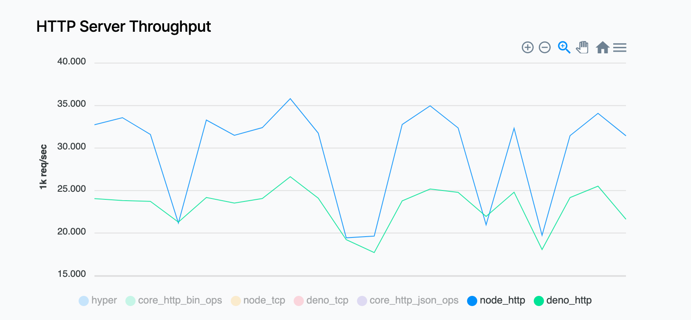
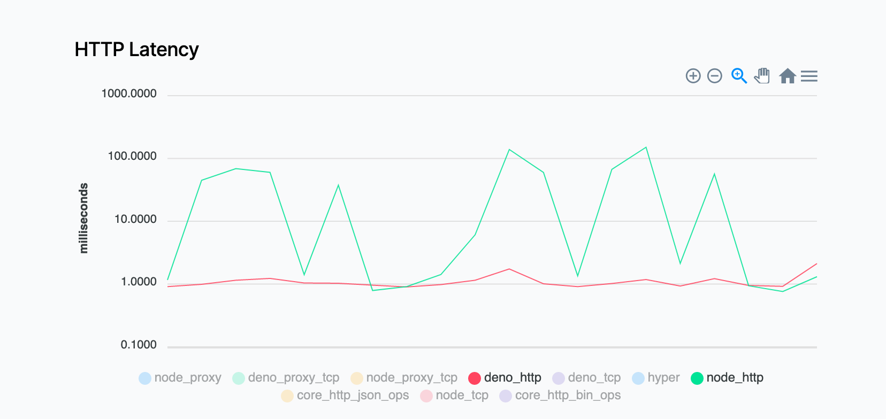

<!-- class: invert -->

# Deno-Presentation

## By Franklin Harvey

---

# Questions and Objectives

- What is Deno
- What are its pros and cons
- Is it production ready? Why or why not?

---

# What is Deno

> Deno is a simple, modern and secure runtime for JavaScript and TypeScript that uses V8 and is built in Rust.

#### My favorite features (quoted from [deno.land](deno.land))

- Secure by default. No file, network, or environment access, unless explicitly enabled.
- Supports TypeScript out of the box.
- Has a set of reviewed (audited) standard modules that are guaranteed to work with Deno: deno.land/std

---

# What is Deno

Written by Ryan Dahl, one of the creators of Node

Explained best in [10 Things I Regret About Node.js](https://www.youtube.com/watch?v=M3BM9TB-8yA)

- Doesn't require `node_modules/` and `package.json`, nor NPM
- Imports are relative or absolute URLs ONLY
  - despite what webpack may allow, this is how the web actually works
  - does `import module from 'module'` point to index.js? or index.ts? what if i don't have an index.js?
- Support top-level await
- Browser compatible (`window` not `global`)
- Remote URLs fetched and cached indefinitely on the first load

---

# What is Deno

## A code example

```typescript
import { serve } from "https://deno.land/std@0.71.0/http/server.ts";
const s = serve({ port: 8000 });
console.log("http://localhost:8000/");
for await (const req of s) {
  req.respond({ body: "Hello World\n" });
}
```

---

# Pros and Cons of Deno




- Performance... differences
- Less modules (11 years of Node modules vs. ~ a year of Deno modules)
  - no Nest, RxJS, AWS library (I'm guessing no FB library either)

---

# Production Ready

- Why or why not?
- How do we define production ready?
- What does Deno offer that we can't get in Python or Java?
